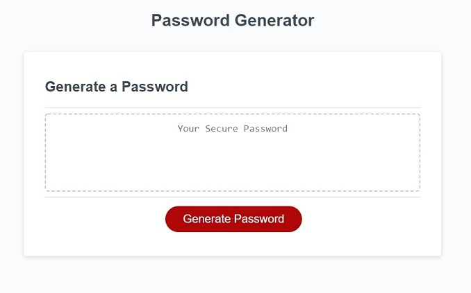
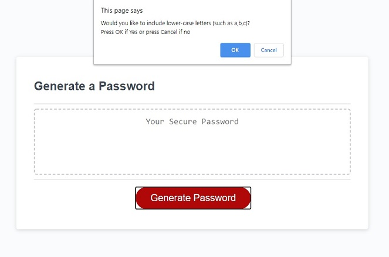
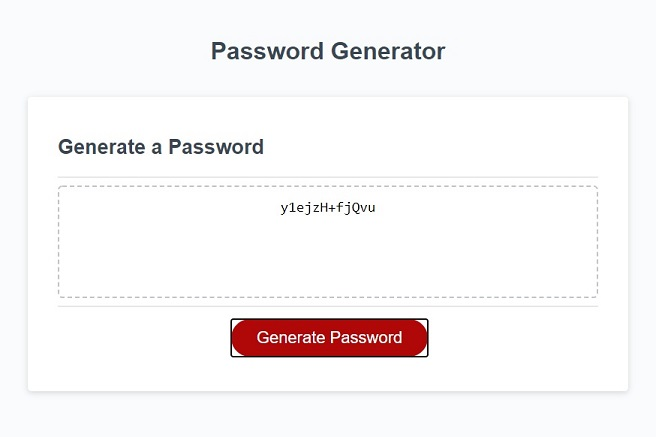

# Password Generator

Displays a randomized password based on user inputed criteria and password length.

## Table of Contents
* [Password Generator Page](#password-generator-screenshot)
* [Deployment](#deployment)
* [Scope of Project](#scope-of-project)
* [Installation](#installation)
* [Noted Resources](#noted-resources)
* [Testing](#testing)
* [Credits](#credits)
* [License](#license)

## Password Generator Screenshot

### Screenshot on page load

### Screenshot of user selection of criteria

### Screenshot of generated password

## Deployment

Site deployed at [Charles Fisher](https://cdfishe1.github.io/password-generator/)

## Scope of Project

* Used ES6 features such as const and let for variable declaration and arrow functions to enhance readability of the script.
* Constructed script so that no variables or arrays are left in the global scope.
* Refactored html and css to reflect semantic elements.

## Installation

Deploy the html file and assets folder that contains the images, css, and javascript files on a website host server.

## Noted Resources

I made particular use of the following resources:

* [parseInt()](https://developer.mozilla.org/en-US/docs/Web/JavaScript/Reference/Global_Objects/parseInt)
* [flat()](https://developer.mozilla.org/en-US/docs/Web/JavaScript/Reference/Global_Objects/Array/flat)

## Testing

Tested accessibility using [WAVE web accessbility evaluation tool](https://wave.webaim.org/report#/https://cdfishe1.github.io/password-generator/)

* Generates 0 errors.

Generates 0 errors on load or through execution.

## Credits

* David Metcalfe, bootcamp tutor, for helping me to understand how to make the password button execute two different functions as well as chainging the functions more efficiently.

## License

Copyright (c) Charles Fisher All rights reserved. 
Please be kind and change content if you wish to use this code.

Licensed under the MIT License

Copyright (c) 2021 - present | Horizon Social Solution Services Inc.

<blockquote>
Permission is hereby granted, free of charge, to any person obtaining a copy
of this software and associated documentation files (the "Software"), to deal
in the Software without restriction, including without limitation the rights
to use, copy, modify, merge, publish, distribute, sublicense, and/or sell
copies of the Software, and to permit persons to whom the Software is
furnished to do so, subject to the following conditions:

The above copyright notice and this permission notice shall be included in all
copies or substantial portions of the Software.

THE SOFTWARE IS PROVIDED "AS IS", WITHOUT WARRANTY OF ANY KIND, EXPRESS OR
IMPLIED, INCLUDING BUT NOT LIMITED TO THE WARRANTIES OF MERCHANTABILITY,
FITNESS FOR A PARTICULAR PURPOSE AND NONINFRINGEMENT. IN NO EVENT SHALL THE
AUTHORS OR COPYRIGHT HOLDERS BE LIABLE FOR ANY CLAIM, DAMAGES OR OTHER
LIABILITY, WHETHER IN AN ACTION OF CONTRACT, TORT OR OTHERWISE, ARISING FROM,
OUT OF OR IN CONNECTION WITH THE SOFTWARE OR THE USE OR OTHER DEALINGS IN THE
SOFTWARE.
</blockquote>

